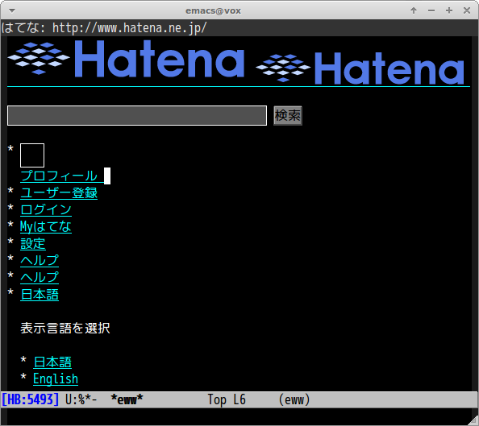

# eww-hatebu.el

[Hatena Bookmarks](http://b.hatena.ne.jp/) count in mode-line.


## Introduction

eww-hatebu.el shows Hatena bookmarks count of current page in mode-line.


## Screenshot




## Requirements

- Emacs 25, development version

This package uses very latest feature of [eww](https://www.gnu.org/software/emacs/manual/html_node/eww/index.html).


## configuration

```lisp
(with-eval-after-load 'eww
  (eww-hatebu-setup))
```
